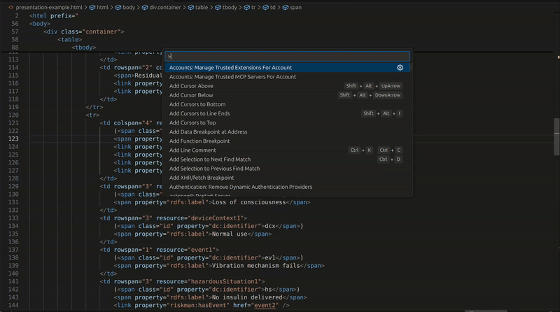
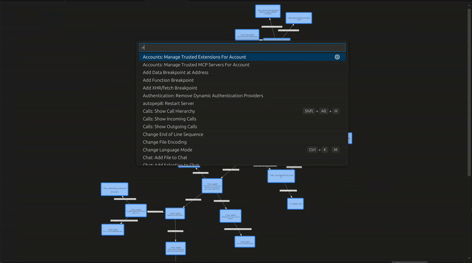
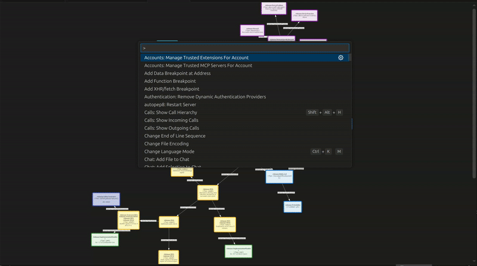

# Riskman

A VSCode extension for visualizing, reasoning over, and validating RDF-based risk management documents conforming to the [Riskman ontology](https://w3id.org/riskman).

## Features

- **Graph visualization** — renders the risk management file (risks, controls, implementation manifests, etc.) as an interactive graph
- **Inference** — runs an OWL reasoner to derive implicit knowledge (i.e. materialisation)
- **SHACL validation** — validates the document against the Riskman shapes and highlights failing nodes directly in the graph
- **Implementation manifest checking** — verifies that all implementation manifests referenced in the risk document are actually present in your workspace source code

## Requirements

- An **OWL reasoner** (a ready-to-use realization wrapper based on HermiT is available at [cl-tud/realization-wrapper](https://github.com/cl-tud/realization-wrapper).)
- **Pyshacl** for SHACL validation (`pip install pyshacl`)

## Extension Settings

| Setting | Description |
|---|---|
| `riskman.reasonerCommand` | Command to run the OWL reasoner. Use `{input}` and `{output}` as placeholders. Example with HermiT via realization-wrapper: `java -jar /path/to/realization-wrapper-hermit-jfact-1.1.jar {input} {output} hermit` |
| `riskman.pyshaclPath` | Path to the `pyshacl` executable |

## Usage

### Typical workflow

1. **Riskman: Extract RDF Graph** — load the active editor file into the graph panel (or use **Riskman: Load Graph** to pick a file via dialog)

2. **Riskman: Run Inference** — run the OWL reasoner to compute derived triples (probabilities, severities); new nodes appear in the graph

3. **Riskman: Validate** — run SHACL validation; nodes with violations are highlighted in red

### Implementation manifest checking

1. **Riskman: Load HTML** or **Riskman: Load RDF** — load the risk document into the Implementation Manifests Explorer panel
2. The tree view lists all implementation manifests from the document and shows which ones are found (or missing) in your workspace
3. Click any item to navigate to the line in your source code where the manifest URI appears

### Other commands

| Command | Description |
|---|---|
| `Riskman: Extract RDF Graph` | Load the currently open editor file as a graph (no file dialog) |
| `Riskman: Refresh entry` | Re-scan the workspace and refresh the manifest tree |
| `Copy URI` | Copy the URI of a selected manifest tree item to the clipboard |
